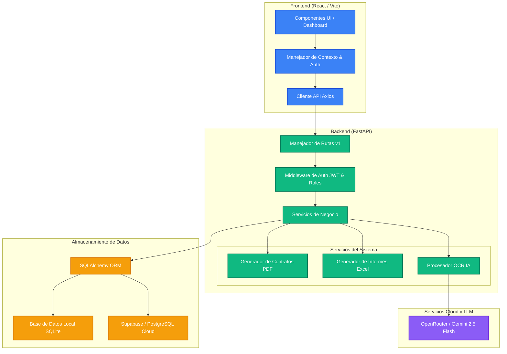

# ConstructERP - Sistema de Gestion de Obras y Proyectos

[](https://fastapi.tiangolo.com/)
[](https://react.dev/)
[](https://vitejs.dev/)
[](https://tailwindcss.com/)
[](https://www.sqlalchemy.org/)
[](https://supabase.com/)
[](https://openrouter.ai/)

ConstructERP es una solucion empresarial modular de alto rendimiento desarrollada a medida para el sector de la construccion y la ingenieria civil. Disenada con un enfoque multi-inquilino (Multi-tenant) y control de acceso basado en roles (RBAC), la plataforma integra la administracion avanzada de recursos humanos (RRHH), el control financiero y presupuestario de obras en tiempo real, el procesamiento digitalizado de facturas mediante tecnologia OCR con Inteligencia Artificial, y un asistente virtual integrado (Capataz AI) para el analisis conversacional de metricas clave.

---

## Caracteristicas Clave

### 1. Gestion Avanzada de Personal y Contratos (RRHH)
* **Gestion Integral del Trabajador:** Registro exhaustivo del personal con validacion de RUT, cargos especificos del rubro, historico de salarios liquidos y asignaciones.
* **Ciclo de Contratos:** Control preciso sobre el vencimiento de contratos a plazo fijo y alertas de renovacion. Generacion instantanea en PDF de contratos de trabajo y anexos oficiales utilizando el motor fpdf2.
* **Calculo Automatico de Vacaciones:** Control y rebaja sistematica de saldos de vacaciones pendientes basado en solicitudes del personal con flujos de aprobacion multinivel.

### 2. Control Financiero y Presupuestario de Obras
* **Presupuesto vs. Gastos Reales:** Monitoreo de presupuestos generales de obras versus los costes reales devengados.
* **Gestion de Sub-presupuestos (Mini-Budgets):** Creacion y desglose de presupuestos secundarios para partidas o subcontratos especificos dentro del proyecto.
* **Historial de Cambios y Logs de Obra:** Bitacora operativa en tiempo real donde los capataces y administradores registran incidencias diarias, avances fisicos e hitos criticos del proyecto.

### 3. OCR Inteligente de Documentos y Facturas
* **Carga y Digitalizacion:** Modulo de carga de facturas de proveedores (formatos de imagen y PDF).
* **Extraccion de Datos por IA:** Procesamiento mediante un modelo OCR potenciado por IA que reconoce automaticamente:
    * Razon Social del Proveedor
    * Identificacion Tributaria (RUT)
    * Fecha de Emision e Importe Neto/Total
    * Categorizacion automatica de gastos de obra (materiales, logistica, herramientas, mano de obra).
* **Asociacion Automatizada:** Vinculacion inmediata del gasto procesado con los costes activos de una obra sin transcripcion manual.

### 4. Capataz AI: Asistente Operacional Integrado
* **Interfaz de Chat en Tiempo Real:** Interfaz con tematica tecnologica ("Tech Shell") que permite conversar directamente con un modelo de lenguaje (Gemini 2.5 Flash via OpenRouter).
* **Consultas Analiticas:** Permite a la gerencia realizar preguntas del tipo: "Cual es la obra con mayor desviacion presupuestaria este mes?" o "Genera un analisis financiero de los proyectos actuales".
* **Consumo Dinamico de Datos:** Capataz AI extrae de forma activa los registros de la base de datos local para devolver analisis precisos y actualizados.

---

## Arquitectura del Sistema

La solucion se divide en dos modulos independientes interconectados por una API REST JSON:



---

## Stack Tecnologico

### Frontend (Cliente)
* **React 18** (Estructura SPA rapida y modular)
* **Vite** (Herramienta de construccion frontend ultrarrapida)
* **Tailwind CSS** (Diseno fluido, responsivo y adaptativo)
* **Lucide React** (Paquete de iconos limpios y modernos)
* **Axios** (Cliente HTTP para solicitudes al servidor de API)

### Backend (Servidor de API)
* **FastAPI** (Framework moderno de Python, asincrono y de alto rendimiento)
* **SQLAlchemy 2.0** (ORM robusto para interacciones seguras y eficientes con DB)
* **Alembic** (Gestion controlada de migraciones de base de datos)
* **PyJWT & Passlib** (Esquema de autenticacion y hashing de contraseñas robusto)
* **FPDF2 & OpenPyXL** (Generacion automatizada de reportes empresariales)

### Infraestructura y Datos
* **PostgreSQL / Supabase** (Almacenamiento relacional de nivel empresarial con soporte nativo de UUID)
* **SQLite** (Motor local ultrarrapido para entornos de desarrollo y evaluacion academica)

---

## Control de Acceso Basado en Roles (RBAC)

ConstructERP implementa una estricta jerarquia de roles para salvaguardar la integridad de la informacion sensible de la empresa:

| Rol | Alcance y Permisos |
| :--- | :--- |
| **`ADMIN`** | Control absoluto. Configuracion de organizacion, gestion de roles, carga inicial de bases de datos. |
| **`HR_MANAGER`** | Foco exclusivo en Recursos Humanos. Creacion de contratos, gestion de salarios, liquidaciones, vacaciones y altas de trabajadores. |
| **`PROJECT_MANAGER`** | Foco en obra. Creacion de tareas, asignacion de trabajadores a frentes especificos, control del diario de obra, carga de gastos puntuales. |
| **`INVENTORY_MANAGER`** | Logistica. Control de consumos de bodega, alertas de stock minimo y catalogacion de herramientas. |
| **`MANAGEMENT`** | Rol de Direccion. Acceso general a paneles financieros, generacion de informes consolidados de rentabilidad y exportaciones a Excel. |

---

## Estructura de Directorios

El repositorio mantiene una clara separacion de responsabilidades:

```text
constructrp/
├── backend/                  # Servidor de API (Python & FastAPI)
│   ├── app/
│   │   ├── ai/               # Modelos y agentes de Inteligencia Artificial
│   │   ├── api/              # Controladores y rutas HTTP por verison (v1)
│   │   ├── core/             # Configuraciones globales, seguridad y variables de entorno
│   │   ├── db/               # Sesion y configuracion de conexiones (SQLAlchemy)
│   │   ├── models/           # Declaracion del modelo de base de datos (ORMs)
│   │   ├── schemas/          # Esquemas de datos para serializacion/validacion (Pydantic v2)
│   │   ├── services/         # Logica de negocio pesada (Generacion PDF, Excel, OCR)
│   │   └── utils/            # Funciones auxiliares genericas
│   ├── requirements.txt      # Dependencias backend de Python
│   ├── seed_rich_data.py     # Script para poblar la DB con datos realistas
│   └── local_erp.db          # Base de datos SQLite local para pruebas rapidas
│
└── frontend/                 # Aplicacion Cliente (React & Tailwind CSS)
    ├── src/
    │   ├── components/       # Componentes visuales y layouts reutilizables
    │   ├── context/          # Estados globales compartidos (Autenticacion, Ajustes)
    │   ├── pages/            # Vistas principales de la aplicacion (Dashboard, Obras, Capataz)
    │   ├── api/              # Configuracion de clientes Axios y llamadas REST
    │   └── utils/            # Utilerias de formateo de moneda y fechas
    ├── index.html            # Punto de montaje principal
    └── package.json          # Dependencias y scripts de construccion frontend
```

---

## Configuracion e Instalacion Local

### Requisitos Previos
* **Python 3.10+** instalado.
* **Node.js 18+** y **npm** instalados.

---

### Paso 1: Configurar el Backend

1. **Navega al directorio del backend:**
    ```bash
    cd backend
    ```

2. **Crea e inicia un entorno virtual (venv):**
    * **En macOS/Linux:**
        ```bash
        python3 -m venv venv
        source venv/bin/activate
        ```
    * **En Windows:**
        ```bash
        python -m venv venv
        venv\Scripts\activate
        ```

3. **Instala las dependencias requeridas:**
    ```bash
    pip install -r requirements.txt
    ```

4. **Crea un archivo `.env` en la raiz de la carpeta `backend`** con el siguiente contenido base:
    ```ini
    PROJECT_NAME="ConstructERP"
    API_V1_STR="/api/v1"
    SECRET_KEY="construct_erp_2026_fixed_key"
    ALGORITHM="HS256"
    # Si no defines DATABASE_URL, el backend usara de manera automatica 'local_erp.db' en SQLite.
    # DATABASE_URL=postgresql://tu_usuario:tu_contraseña@tu_host/tu_db
    OPENROUTER_API_KEY="tu_key_aqui" # Opcional para habilitar la conversacion con Capataz AI
    ```

5. **Inicializa y puebla la base de datos con datos de prueba realistas:**
    ```bash
    python seed_rich_data.py
    ```

6. **Inicia el servidor backend en modo desarrollo:**
    ```bash
    uvicorn app.main:app --reload --port 8000
    ```
    *El servidor backend estara disponible en: http://localhost:8000*  
    *La documentacion interactiva de la API estara en: http://localhost:8000/docs*

---

### Paso 2: Configurar el Frontend

1. **Navega al directorio del frontend:**
    ```bash
    cd ../frontend
    ```

2. **Instala los paquetes de Node.js:**
    ```bash
    npm install
    ```

3. **Asegura la configuracion de conexion en un archivo `.env` en la carpeta `frontend`:**
    ```ini
    VITE_API_URL=http://localhost:8000/api/v1
    ```

4. **Inicia el servidor frontend en modo desarrollo (Vite):**
    ```bash
    npm run dev
    ```
    *El frontend estara listo en el puerto indicado por consola (normalmente http://localhost:5173).*

---

## Credenciales de Acceso por Defecto (Seed Data)

Si utilizaste el script `seed_rich_data.py`, puedes ingresar a la plataforma utilizando los siguientes perfiles de demostracion:

| Correo Electronico | Contrasena | Rol Asignado |
| :--- | :--- | :--- |
| `admin@serconind.cl` | `admin` | **`ADMIN`** (Acceso total) |
| `gerente@serconind.cl` | `gerente` | **`MANAGEMENT`** (Acceso de direccion) |

---

## Roadmap de Proximas Mejoras
* **Integracion de Firma Digital:** Firma electronica en contratos laborales y anexos bajo normativa legal vigente.
* **Gestion de Cubicaciones en 3D:** Modulo para leer modelos BIM (IFC) y cruzar presupuestos directamente con el inventario real.
* **Planificacion Offline:** Sincronizacion de bitacoras del capataz en areas rurales o tuneles subterraneos sin conectividad de red.
* **Notificaciones por Canales Externos:** Alertas directas a WhatsApp corporativo ante incidentes y stock critico.

---

Este proyecto ha sido estructurado con altos estandares de desarrollo de software, priorizando la mantenibilidad, escalabilidad de la base de datos, y una experiencia de usuario sobresaliente.
